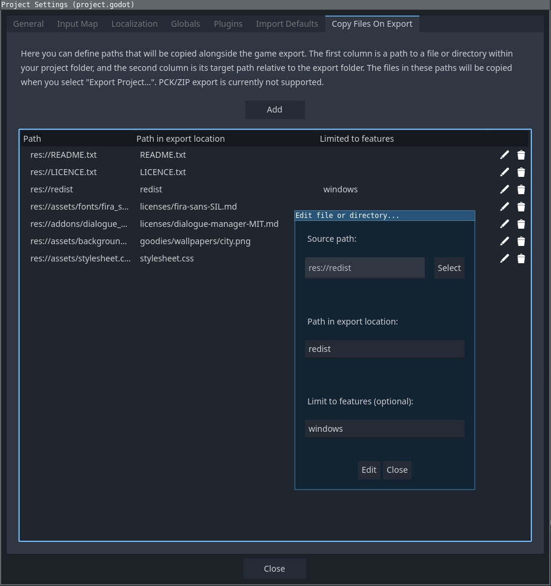

# Copy Files On Export, a Godot addon

Copy Files On Export is an addon for [Godot 4](https://godotengine.org) which allows you to define a set of files and directories which will be copied alongside the project when it is exported, optionally filterable by feature! Useful if you want to include a README or other files for your users without having to copy the files manually or set up automation via external means.



The minimum supported Godot version is Godot 4.2, although it likely also works on older Godot 4 releases.

## Installation

First, make sure you have a valid Godot engine version.

Download the ZIP from github and put the `addons` folder in your project root or just look up the addon on the Godot AssetLib and press Download!

Then head to the _Project_ → _Project Settings_ → _Plugins_ and check the box next to the "Copy Files On Export" addon. In the project settings, a new tab with the same name should appear. If not, restarting Godot should fix it!

## Usage

To configure the addon, head to _Project_ → _Project Settings_ → _Copy Files On Export_. The table in that section defines the file and directory mappings which will be copied to the export location. Click `Add` to add a new mapping. Then press `Select` and navigate to the file or directory you wish to include in your export destination. Then for `Path in export location` type a valid path which defines the destination of the mapped file. The following formats should work:

* `some-file.txt`
* `foo/bar/some-file.txt`
* `/foo/bar/some-file.txt`
* `./foo/bar/some-file.txt`
* `foo/bar/baz` (for directories)
* etc.

If you want to limit the mapping to one or more specific feature tags, you can enter them comma-separated in the `Limit to features` field.

For example, if you define the following set of mappings:

| Path                                    | Path in export location          | Limited to features   |
|-----------------------------------------|----------------------------------|-----------------------|
| res://README.txt                        | README.txt                       |                       |
| res://LICENCE.txt                       | LICENCE.txt                      |                       |
| res://redist                            | redist                           | windows               |
| res://assets/fonts/fira_sans/LICENSE.md | licenses/fira-sans-SIL.md        |                       |
| res://addons/dialogue_manager/LICENSE   | licenses/dialogue-manager-MIT.md |                       |
| res://assets/backgrounds/city.png       | goodies/wallpapers/city.png      | windows, macos, linux |
| res://assets/stylesheet.css             | stylesheet.css                   | web                   |

After exporting your project your target folder (or ZIP file) will have the following structure:

```
.
├── goodies/
│   └── wallpapers/
│       └── city.png
├── licenses/
│   ├── dialogue-manager-MIT.md
│   └── fira-sans-SIL.md
├── redist/
│   ├── map-editor.exe
│   └── NDP481-Web.exe
├── LICENSE.txt
├── README.txt
├── stylesheet.css
├── your_game.exe
└── your_game.pck
```

The file `goodies/wallpapers/city.png` will only be included in exports with the `windows` `macos` or `linux` feature tags (i.e. Windows, MacOS or Linux exports), while `stylesheet.css` will be included in exports which have either the `web` or `linux` tags. The `redist` folder will only be included on Windows exports.

Directories will be copied recursively - their contents will be copied in their entirety. For your convenience, `.import` and `.uid` files will be skipped.

On MacOS, the data will be placed alongside the `*.app`. Android and iOS exports are currently untested, therefore, "officially" unsupported. I'll appreciate any test results you can post!

## Troubleshooting

If you are experiencing problems, don't hesitate to open an issue here in the repository. Be sure to include your operating system, the Godot and plugin versions you are using and, if possible - detailed reproduction steps.

Feature requests are also welcome!

## Thanks

Thanks to Janis Dimants for icons and testing on Windows!
